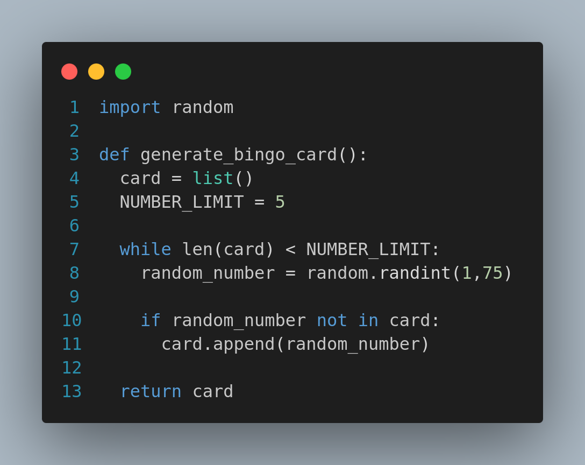
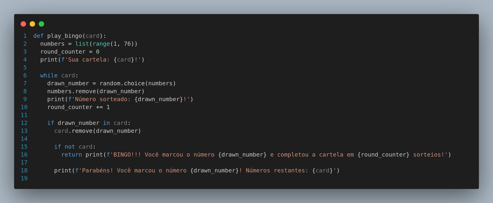

# Desafio 3 - Bingo da Adivinhação na Rede Polkadot

## Objetivo
  Desenvolver um programa em Python que simule um jogo de bingo. Neste caso, a
cartela representa uma carteira de DOT, e você precisará adivinhar os números para completar
a transferência segura.

## Regras do Desafio:
1. O programa deverá gerar uma cartela de bingo para você, composta por 5 números aleatórios diferentes entre 1 e 75.
2. O computador sorteará números aleatórios, um de cada vez.
3. Você deverá adivinhar quais números foram sorteados.
4. Se você acertar um número, ele será marcado na cartela (removido da lista).
5. O jogo continua até que você complete todos os números da cartela.
6. O programa deverá contar e exibir o número total de sorteios necessários para completar a cartela.

## Explicação do Código

  
Imagem

  

- `generate_bingo_card()`:
  - `card = list()`: Cria uma lista vazia para armazenar os números da cartela.
  - `NUMBER_LIMIT = 5`: Constante que define a quantidade máxima de números que a cartela terá.
  - ` while len(card) < NUMBER_LIMIT`: O loop continua enquanto a quantidade de elementos na lista card for menor que o limite definido.
  - `random_number = random.randint(1,75)`: Um número aleatório entre 1 e 75 é gerado utilizando a função random.randint().
  - `if random_number not in card`: Antes de adicionar o número à cartela, verifica-se se ele já existe na lista.
  - `card.append(random_number)`: Se o número não estiver na lista, ele é adicionado ao final da lista card utilizando o método append().

  
Imagem

  

- `play_bingo()`:
  - `numbers = list(range(1, 76))`: Cria uma lista com todos os números possíveis do bingo (de 1 a 75), que serão sorteados ao longo da partida.
  - `round_counter = 0`: Inicializa um contador zerado para acompanhar a quantidade de rodadas.
  - `print(f'Sua cartela: {card}!')`:  Imprime a cartela do jogador no início da partida.
  - `drawn_number = random.choice(numbers)`: Sorteia um número aleatório da lista de números disponíveis e o armazena na variável drawn_number.
  - `numbers.remove(drawn_number)`: Remove o número sorteado da lista de números disponíveis para evitar que ele seja sorteado novamente.
  - `print(f'Número sorteado: {drawn_number}!')`: Imprime o número sorteado na rodada.
  - `if drawn_number in card`: Verifica se o número sorteado está na cartela do jogador.
  - `card.remove(drawn_number)`: Se o número estiver na cartela, ele é removido.
  - `if not card`: Se após a remoção a cartela estiver vazia (todos os números foram marcados), o jogador faz BINGO.
    - Se a cartela ainda tiver números, imprime uma mensagem informando que o jogador marcou o número e quais números ainda faltam marcar.
  

